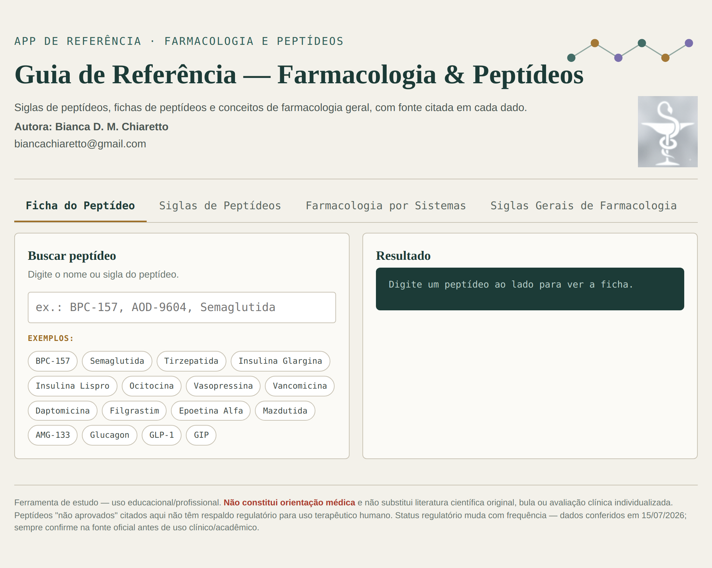
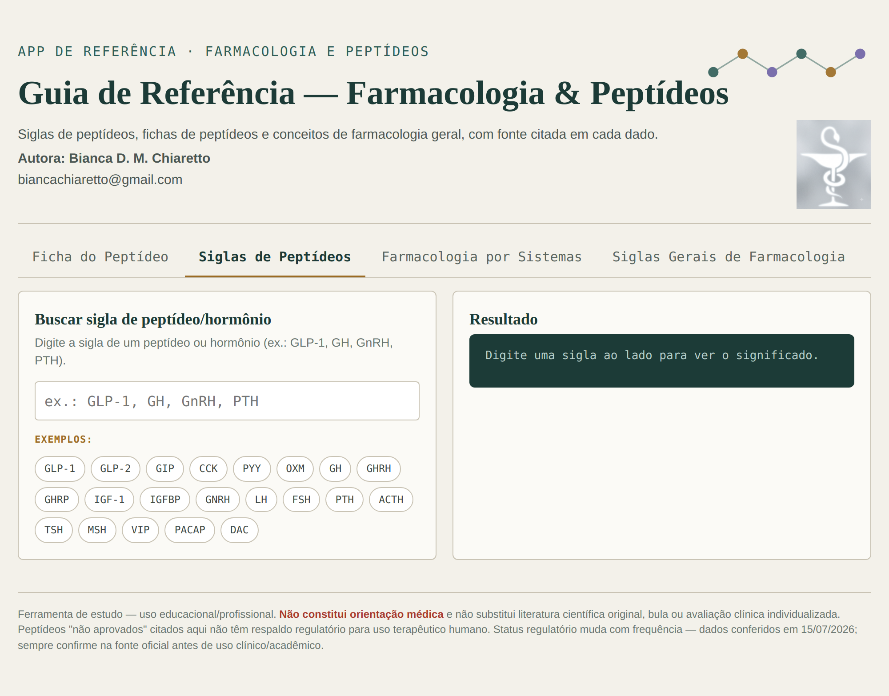
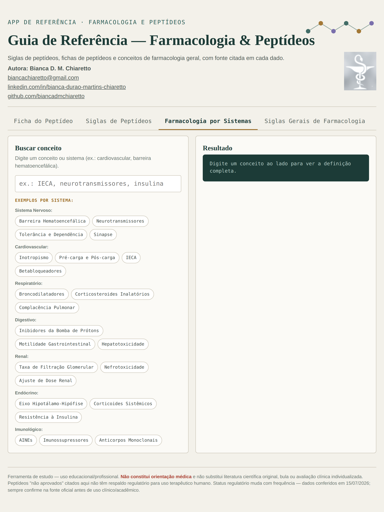
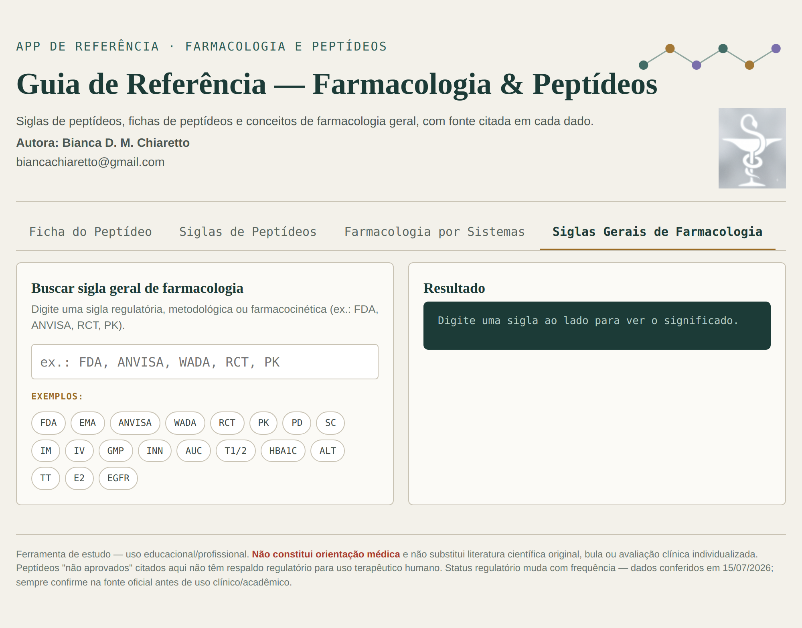

# 📖 Guia de Referência — Farmacologia & Peptídeos

Ferramenta de consulta rápida com fichas de peptídeos, siglas farmacológicas e conceitos de farmacologia geral, com fonte citada em cada dado.

**Autora:** Bianca D. M. Chiaretto
**Contato:** biancachiaretto@gmail.com

> ⚠️ Ferramenta de estudo — uso educacional/profissional. Não constitui orientação médica e não substitui literatura científica original, bula ou avaliação clínica individualizada. Peptídeos "não aprovados" citados aqui não têm respaldo regulatório para uso terapêutico humano. Status regulatório muda com frequência — sempre confira na fonte oficial antes de uso clínico/acadêmico.

---

## 📥 Como usar

Este guia é um arquivo único (`guia-referencia-farmacologia-peptideos.html`) que roda **inteiramente no seu navegador**, sem precisar instalar nada, sem internet e sem enviar nenhum dado para servidor algum.

**Passo 1 — Baixar o arquivo**
Clique no arquivo [`guia-referencia-farmacologia-peptideos.html`](./guia-referencia-farmacologia-peptideos.html) acima neste repositório → botão **"Download raw file"** (ícone de seta para baixo) → salve em qualquer pasta do seu computador.

**Passo 2 — Abrir no navegador**
Dê duplo clique no arquivo baixado. Ele abre automaticamente no seu navegador padrão. Se preferir escolher manualmente, clique com o botão direito → **"Abrir com"** → selecione um dos navegadores abaixo:

| Navegador | Funciona? |
|---|---|
| 🟢 Google Chrome | ✅ Sim |
| 🟠 Mozilla Firefox | ✅ Sim |
| 🔵 Microsoft Edge | ✅ Sim |
| 🧭 Safari (Mac/iPhone) | ✅ Sim |

Não precisa de conexão com a internet depois de baixado — toda a busca roda localmente no seu navegador.

---

## 🖥️ Telas do guia

### 1. Ficha do Peptídeo
Busque um peptídeo pelo nome ou sigla (ex.: BPC-157, Semaglutida) e veja sua ficha completa.

### 2. Siglas de Peptídeos
Consulta rápida de siglas específicas de peptídeos e hormônios.

### 3. Farmacologia por Sistemas
Conceitos de farmacologia organizados por sistema do corpo.

### 4. Siglas Gerais de Farmacologia
Siglas gerais usadas em farmacologia (ex.: FDA, ANVISA, RCT, PK).

---

## 🛠️ Tecnologia

HTML, CSS e JavaScript puros — um único arquivo, sem dependências externas, sem build, sem instalação. Desenvolvido com apoio de Inteligência Artificial (Claude, Anthropic). Todos os dados têm fonte referenciada (FDA, EMA, ANVISA, DrugBank, PubMed).

## 📄 Licença

Uso livre para fins educacionais e de estudo.
